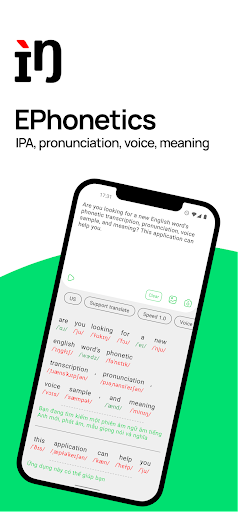
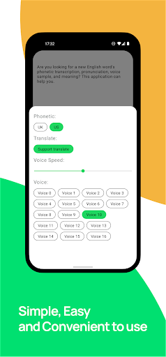
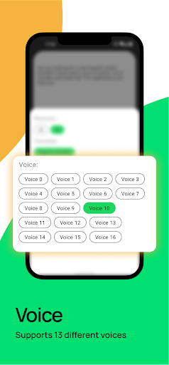

# EPhonetics: IPA English

## Demo

## Description

IPA, Phonetics English-UK and English-US, voice, and meaning of words.

 |  |  |  | 
--- | ---  | ---  | ---  | --- 

Are you looking for a new English word's phonetic transcription, pronunciation, voice sample, and meaning? This application can help you.

EPhonetics provides an IPA system of English-UK and English-US pronunciations along with the meaning and 13 different voice samples of the word instantly (even when you're Offline). In addition, you can change the reading speed so that you can practice accordingly.

EPhonetics supports many forms of lookup such as lookup via keyboard, lookup via Camera, and lookup via Gallary.

You can easily review your previous search history.

## Thank

[IPA-dict](https://github.com/open-dict-data/ipa-dict)

[Hoanganhtuan95ptit-Android-Base](https://github.com/hoanganhtuan95ptit/core)

[Hoanganhtuan95ptit-Android-HackBottomSheet](https://github.com/hoanganhtuan95ptit/Android-HackBottomSheet)
