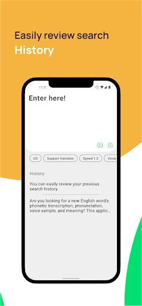

# EPhonetics: IPA English

## Demo

## Description

IPA, Phonetics English-UK and English-US, voice, and meaning of words.

 |  |  |  | 
--- | ---  | ---  | ---  | --- 

### EPhonetics – Your Ultimate English Pronunciation App  

Are you looking for **phonetic transcription**, **accurate English pronunciation**, **diverse voice samples**, and **the meaning of new English words**? Discover **EPhonetics** – a **comprehensive and smart English learning app** designed to help you master **English pronunciation skills** according to international standards.  

### Key Features of EPhonetics  
- **IPA transcription system** with precise phonetics for both **British English (BrE)** and **American English (AmE)**, giving you an in-depth understanding of pronunciation.  
- **Flexible transcription language selection**, catering to the diverse needs of global users.  
- **13 different voice samples**, ranging from **Standard British English (Oxford)** to **popular American accents**, to practice listening and speaking effectively.  
- **Offline mode** lets you look up words and practice anytime, anywhere, without an internet connection.  
- Adjustable **reading speed**, from slow to fast, suitable for learners at every level, from **beginner** to **advanced**.  

### Multiple Word Lookup Options  
- Search quickly and easily via **keyboard input**.  
- Use your **camera** for real-time word recognition.  
- Look up words from **images in your gallery**, optimizing your learning from personal resources.  

### Additional Tools  
- Review your **search history** to revisit and reinforce previously looked-up words.  
- **Learn English vocabulary**, improve your communication skills, and perfect your pronunciation for exams like **IELTS**, **TOEFL**, or **TOEIC**, as well as for daily conversations.  

### Expand Your Knowledge with Open Source  
**EPhonetics** is an **open-source project**, encouraging users to explore, learn, and innovate with its source code. Access the source code here:  
[https://github.com/hoanganhtuan95ptit/Phonetics](https://github.com/hoanganhtuan95ptit/Phonetics)  
⚠️ **Note**: Unauthorized duplication of the app is a copyright violation.  

### Download **EPhonetics** Today!  
Become a professional English learner, conquer exams like **IELTS**, **TOEFL**, **TOEIC**, and communicate confidently in English, just like a native speaker!  

---

## Thank

[IPA-dict](https://github.com/open-dict-data/ipa-dict)

[Hoanganhtuan95ptit-Android-Base](https://github.com/hoanganhtuan95ptit/core)

[Hoanganhtuan95ptit-Android-HackBottomSheet](https://github.com/hoanganhtuan95ptit/Android-HackBottomSheet)
